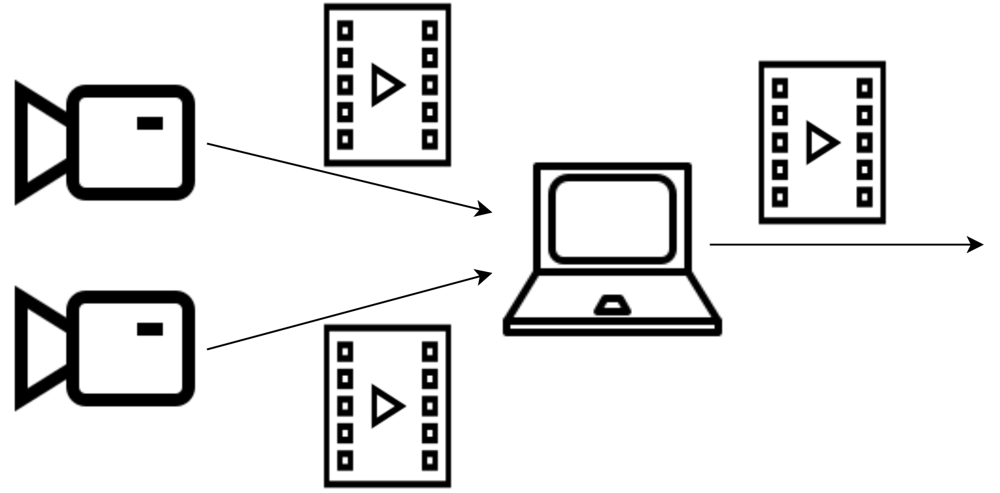

[](https://github.com/mitwelten/mitwelten-fs22-imvs30/actions/workflows/run_tests.yml)

# mjpeg-multiplexer

The mjpeg-multiplexer is a command line tool which combines one or more MJPEG streams into an output stream.

## Prerequisites

- libjpeg-turbo:
[libjpeg-turbo](https://libjpeg-turbo.org/) is a free library with functions for efficient handling of the JPEG image data format.

Installation on Ubuntu:
```
$ sudo apt-get install -y libjpeg-turbo8
```
  
Installation on Debian:
```
$ sudo apt-get install -y libjpeg62-turbo
```

## Building & Installation

- Prerequisites: go 1.19+

- Clone repo
- Change into folder
- Build with the go toolchain using `go build`

    ```
  $ git clone git@github.com:mitwelten/mitwelten-fs22-imvs30.git
  $ cd mitwelten-fs22-imvs30
  $ go build -o "mjpeg_multiplexer" ./src/main.go
    ```

## Usage

This script can be parameterised and has different modes. First argument determines the mode.
See help for detailed usage:

```
$ ./mjpeg_multiplexer --help
  
  Usage: $ ./mjpeg_multiplexer [grid | panel | carousel] input [URL] output [URL] [options...]
                               <--------- mode --------> <- input -> <- output ->

  The multiplexer combines multiple MJPEG input streams to an output stream.
  
  Mode:
    grid: static grid of images with X rows and Y columns
    panel: dynamic panel of images. Can be used with activity detection (see --activity)
    carousel: dynamic carousel view, switched between images. Can be used with activity detection (see --activity)
  Input:  comma separated list of urls including port
  Output: output port
  
  Examples: 
    $ ./mjpeg_multiplexer grid input localhost:8080,localhost:8081 output 8088
    $ ./mjpeg_multiplexer panel input :8080,:8081,:8082 output 8088 --panel_cycle --width 800 
    $ ./mjpeg_multiplexer carousel input 192.168.0.1:8080 192.168.0.2:8081 output 8088 --activity
  
  Options:
    --grid_dimension [list]          Comma separated list of 2 numbers of cells in the grid mode, eg. '--grid_dimension "3,2"'
    --activity                       Enables activity detection to focus the most active frame on selected mode
    --panel_cycle                    Enables cycling of the panel layout, see also [--duration] 
    --duration [number]              Duration in seconds before changing the layout (panel and carousel only) [default: 15]
    --width [number]                 Total output width in pixel
    --height [number of number]      Total output height in pixel
    => if only the height or width is specified, the other will be adjusted with regards to the ascpect ratio
    --ignore_aspect_ratio            Stretches the frames instead of adding a letterbox on resize
    --framerate [number]             Limit the output framerate per second
    --quality [number]               Output jpeg quality in percentage [default: 80]
    --use_auth                       Use Authentication
    --show_border                    Enables a border in the grid and panel layout between the images
    --show_label                     Show label for input streams
    --labels [list]                  Comma separated list of alternative label text, eg. '--labels "label 1, label 2"'
    --label_font_size [number]       Input label font size in pixel [default: 32]
    --log_fps                        Logs the current FPS 
    -v --version                     Shows version.
    -h --help                        Shows this screen
  
  Authentication to connect to mjpeg_streamer streams secured by credentials can be enabled using the [--use_auth] flag. Add the credentials to the 'authentication.json' file. See 'authentication_example.json' as an example.`
```

## Examples

- Grid 
```
  $ ./mjpeg_multiplexer grid input :8080,:8081,:8082,:8083 output 8088 --grid_dimension 2,2 --width 1280
```

- Panel (with `--activity` and custom labels)
```
  $ ./mjpeg_multiplexer panel input :8080,:8081,:8082,:8083 output 8088 --quality 100 --activity --log_fps --show_label --labels "Wild-Cam 1,Wild-Cam 2,Sea-Cam 1,Sea-Cam 2"
```

- Carousel (with passthrough for high fps)
```
  $ ./mjpeg_multiplexer carousel input :8080,:8081,:8082,:8083,:8084 output 8088
```

- Panel (with `--panel_cycle` and `--duration`)
```
  $ ./mjpeg_multiplexer panel input localhost:8080,localhost:8081,localhost:8082 output 8088 --panel_cycle --duration 60
```

- Panel (resize output to width 1080 and adjust height accordingly)
```
  $ ./mjpeg_multiplexer panel input localhost:8080,localhost:8081,localhost:8082 output 8088 --width 1080
```

- Panel (resize output to width 1080 and height 1920)
```
  $ ./mjpeg_multiplexer panel input localhost:8080,localhost:8081,localhost:8082 output 8088 --width 1080 --height 1920
```

- Panel (resize output to width 1080 and height 1920, ignore aspect ratio)
```
  $ ./mjpeg_multiplexer panel input localhost:8080,localhost:8081,localhost:8082 output 8088 --width 1080 --height 1920 --ignore_aspect_ratio
```
- Grid (with default labels and adjusted label font size)
```
  $ ./mjpeg_multiplexer grid input :8080,:8081,:8082,:8083 output 8088 --show_label --label_font_size 100
```

- Grid (using authentication, adjust the `authentication.json` file)

authentication.json
```json
[
    {
        "Url": "192.168.0.42:8080",
        "Username": "username",
        "Password": "password"
    },
    {
        "Url": "localhost:8081",
        "Username": "username",
        "Password": "password"
    },
    {
        "Url": "hostname:8082",
        "Username": "username",
        "Password": "password"
    }
]

```
```
  $ ./mjpeg_multiplexer grid input 192.168.0.42:8080,localhost:8081,hostname:8082 output 8088 --use_auth
```
